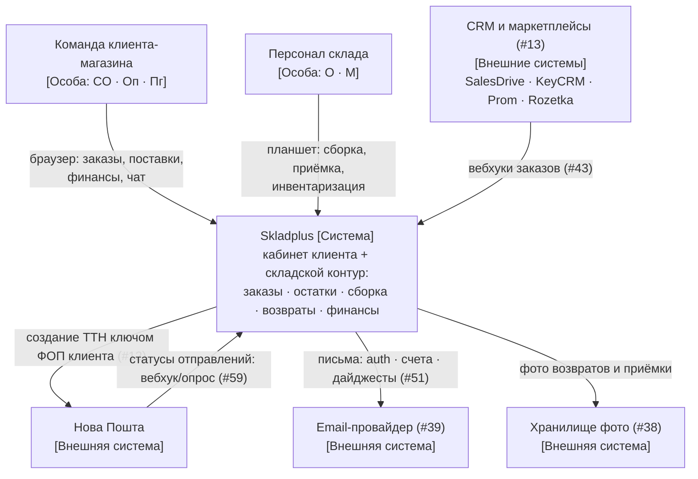
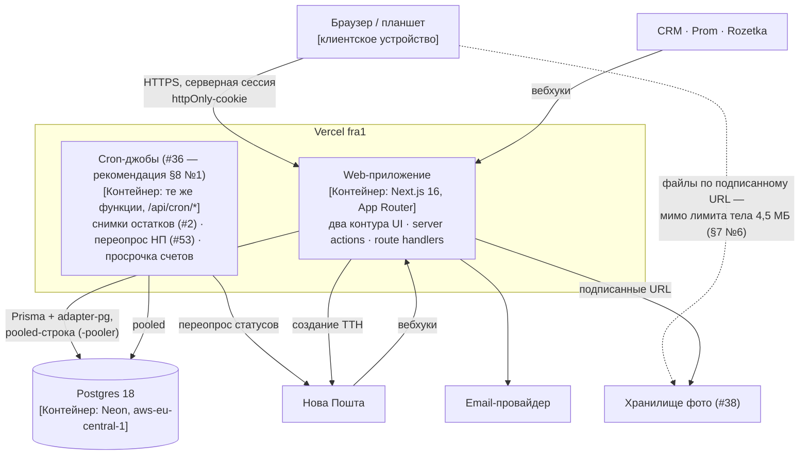
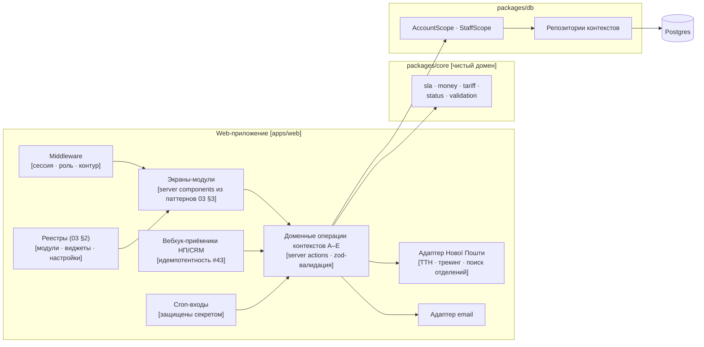

# 05 — Системный дизайн: схема, модули, структура, узкие места

Статус: **черновик на ревью**. Документ отвечает на вопрос «как система
устроена целиком»; решения из §8 требуют ответа людей и помечены опросником.
Журнал решений — `docs/06-architecture.md`, поведение — `docs/02-product-spec.md`,
данные — `docs/04-domain-draft.md`, интерфейс — `docs/03-ux-ui.md`, распределение
работ — `docs/08-workplan.md`. Здесь ничего из них не дублируется — только
связывается в одну картину.

`#N` — пункт `docs/09-findings-backlog.md`; ссылка на GitHub идёт
со словом: `PR #23`, `issue #16`.


## 1. Контекст и нагрузка

Веб-платформа фулфилмента для одного склада (Харьковская область): кабинет
клиентов-магазинов плюс складской контур. Заменяет связку «Google-таблица +
чат + Telegram-бот».

- Нагрузка: ~15 000 заказов/мес ≈ 500/день, пик порядка сотни в час —
  **единицы RPS**. Одновременных пользователей — десятки: персонал склада
  и команды клиентов.
- Критичное окно доступности — рабочие часы склада 8:00–20:00 Kyiv: внутри
  него живёт SLA сборки «30 рабочих минут» (02 §6). Ночная недоступность
  неприятна, но не роняет SLA.
- Профиль запросов: много мелких чтений (очередь сборки, списки, живые
  таймеры), заметно меньше записей; тяжёлое — отчёты, Excel-импорт/экспорт.

Прикидка «на салфетке» (Step 1 методики system-design-primer):

- **Данные.** Заказ порождает ~20 строк (позиции, события статусов, движения
  остатков, проводки, задача сборки): ~3,6 млн строк/год, при средней строке
  0,5–1 КБ вместе с индексами — **2–4 ГБ в год**. Это на порядки ниже
  объёмов, где Postgres требует партиционирования или шардинга.
- **Чтение/запись ≈ 50:1.** Записи — ~10 тыс. строк в день ровным потоком,
  доли RPS; чтения — поллинг очереди и списков десятками вкладок каждые
  10–60 с плюс работа людей. Поэтому приоритет — индексы и материализации
  (`Stock`, снимки), а не оптимизация записи.

Вывод, определяющий всё остальное: **это нагрузка одного Postgres и одного
приложения.** Архитектура оптимизируется под скорость разработки вдвоём и
корректность инвариантов (деньги, остатки, права) — не под горизонтальное
масштабирование, которого эта нагрузка не потребует.

## 2. Общая схема (C4)

Три уровня по модели C4: контекст → контейнеры → компоненты. Нотация —
обычный mermaid-flowchart с C4-подписями в квадратных скобках: рендерится
надёжно, правится диффом. Четвёртый уровень («код») не рисуем — его роль
играет доменная схема `docs/04-domain-draft.md`.

### 2.1 Контекст: система и её окружение



Получатель заказа в системе не работает — он появляется только данными
(таблица `Recipient`, обезличивание #18). Заказчик-владелец склада — роль `O`
внутри персонала, не отдельный актор.

### 2.2 Контейнеры: что где запущено



Cron-джобы — не отдельный процесс, а те же serverless-функции приложения,
которые Vercel дёргает по расписанию: контейнер логический, деплой один.
Это **рекомендация** (§8 №1): решение #36 — `[contract]`, ещё не принято
вдвоём; альтернативы изменят этот узел схемы и папку `api/cron/`.

Конвейер доставки уже работает (06-architecture): GitHub Actions
с агрегатом `ci-ok` на PR → squash-merge в `main` → `migrate.yml` применяет
миграции к Neon по **прямому** подключению (`concurrency: deploy-main`)
параллельно со сборкой Vercel; гонку «код раньше миграции» снимает дисциплина
expand/contract (#37, этап 4).

### 2.3 Компоненты web-приложения



Ключевое свойство уровня: **все дороги к данным сходятся в одну точку.**
Экран, вебхук и cron-джоб вызывают одни и те же доменные операции; операции
считают правила в `core` и ходят в базу только через scope-примитивы —
поэтому матрицы прав 02 §3 и инварианты §3 проверяются в одном месте,
а не в каждом входе заново.

Эффекты перехода статуса (резерв, проводка) выполняются в одной транзакции
с самим переходом; уведомление в ней только записывается, а уходит после
commit — доставку почты откатить нельзя.

## 3. Модули и зоны ответственности

Деление — по ограниченным контекстам (06-architecture), оно же — деление работ
между двумя разработчиками «от таблицы до экрана» (08). Каждый контекст владеет
своими таблицами (04), экранами (02) и проверками прав. Общих точек ровно три:
схема Prisma (`[contract]`-PR), `packages/core` и реестры каркаса UI.

| Контекст | Владеет | Ключевые инварианты границы |
|---|---|---|
| **A. Идентичность и доступ** | `User…ShipperProfile`, машина онбординга (02 §5.4), auth-экраны | пароль живёт только argon2id-хешем; права читаются из БД на каждый запрос, не из снимка сессии; чужой account — 404, не 403 |
| **B. Товары · поставки · остатки** | `Product…SupplyItem`, комірки, движения, инвентаризация | остаток меняется только движением — прямой правки числа не существует; `Stock` — материализация журнала `StockMovement`; хранение тарифицируется только по замеру склада (#58) |
| **C. Заказы · сборка · возвраты** | `Order…ReturnComment`, очередь сборки, SLA | резерв берётся сервером атомарно в транзакции создания заказа (#10); переходы статусов — только из таблиц 02 §5; каждый переход — событие журнала |
| **D. Поддержка · настройки · уведомления** | `SupportThread/Message`, `Setting`, email-рассылки | настройки типизированы дефинициями с zod (03 §2.3), «свободного JSON» нет; тред не теряется — дежурство `onShift` (#54) |
| **E. Финансы** | тарифы, проводки, счета, комиссии | проводки append-only с зафиксированной ценой и формулой (#6); деньги — `bigint`, целые копейки; долг = сумма проводок, отдельного «баланса» нет (#19) |

Поперёк контекстов лежат не сервисы, а **слои чистоты**:

- `packages/core` — чистые функции домена: рабочие минуты 8:00–20:00 Kyiv (#5),
  приоритет очереди (02 §6), расчёт проводок и комиссий, допустимость переходов
  статусов. Без React, Next и Prisma — тестируется голым Vitest; тестов пока нет.
- `packages/db` — единственная дверь к данным: `forAccount(accountId)` отдаёт
  `AccountScope` с обязательным `accountId`; `StaffScope` — для кросс-аккаунтных
  выборок персонала (06-architecture). Прямой Prisma из `apps/` запрещён.
- Каркас UI (03 §2–3) — реестры модулей/виджетов/настроек и библиотека
  паттернов («раздел-таблица», «двухколоночная форма», сканер-паттерн…).

**Правило межконтекстного взаимодействия:** в таблицы чужого контекста
никто не пишет напрямую — контекст вызывает доменную операцию
контекста-владельца. Создание заказа (C) не пишет `StockMovement` само:
оно вызывает у B операцию «зарезервировать», передавая транзакцию Prisma, —
резерв и заказ фиксируются атомарно, а инвариант «остаток меняется только
движением» имеет одного хозяина.

Читать чужие таблицы через свои scope-примитивы можно — правило касается
записи.

## 4. Структура папок

Целевая структура; `✓` — уже существует в скелете, остальное появляется по
задачам 08. Отметки сверяет шаг CI в job `guards` в обе стороны: отмеченный
путь обязан быть в git, неотмеченный — нет, кроме предка отмеченного: он
существует по определению. Принцип из 03 §2.1: «один модуль = одна папка
роута + одна запись реестра».

```text
apps/web/
├── app/
│   ├── (auth)/                  # вхід · реєстрація · відновлення · підтвердження (02 §4.1)
│   ├── app/                     # кабинет клиента — layout контура (роли CO/Оп/Пг)
│   │   ├── layout.tsx           # меню из реестра модулей
│   │   └── <модуль>/…           # замовлення/ товари/ поставки/ фінанси/ …
│   ├── warehouse/               # складской контур — layout (роли O/M)
│   │   └── <модуль>/…           # queue/ receiving/ inventory/ returns/ …
│   ├── print/                   # print-роуты без layout: этикетка ТТН, акты (03 §4)
│   ├── api/
│   │   ├── health/            ✓ # проверка живости (с обходом Vercel Authentication)
│   │   ├── cron/<job>/          # входы Vercel Cron, защищены секретом (#36 — рекомендация §8 №1)
│   │   └── webhooks/<источник>/ # НП, CRM; идемпотентность по externalId (#43)
│   ├── globals.css            ✓ # токены и подключение Tailwind (03 §4)
│   ├── layout.tsx             ✓
│   └── page.tsx               ✓
├── modules/                     # реестр: <id>/manifest.ts · widgets.tsx · settings.ts
├── components/                  # паттерны 03 §3: SectionTable, TwoColumnForm,
│   │                            #   ScannerScreen, SetupBlocker, StatusBadge…
│   └── ui/                      # shadcn/ui поверх токенов (отдельный PR, 08 §1.3)
├── lib/                         # клей: auth-провайдер (#44), движок реестров,
│   │                            #   Intl-форматтеры uk-UA/Europe/Kyiv
│   ├── utils.ts               ✓ # cn(): clsx + tailwind-merge для shadcn/ui
│   ├── np/                      # адаптер Нової Пошти: ТТН · трекинг · отделения
│   └── email/                   # адаптер транзакционной почты (#39)
├── components.json            ✓ # реестр shadcn/ui: стиль и алиасы
├── next.config.ts             ✓
├── postcss.config.mjs         ✓ # Tailwind 4 — плагином PostCSS
└── vercel.json                ✓ # сборка: сначала prisma generate (06-architecture)

packages/core/                 ✓ # чистый домен, без React/Next/Prisma (шаг CI)
└── src/                       ✓
    ├── sla/                     # рабочие минуты (#5), дедлайны, приоритет (02 §6)
    ├── money/                   # bigint-копейки: сложение, формат, суффикс Kop
    ├── tariff/                  # проводки по строкам тарифа (02 §7), комиссии (#47)
    ├── status/                  # машины статусов 02 §5 как данные + проверка переходов
    └── validation/              # zod-схемы форм — одна схема на форму и API

packages/db/                   ✓
├── prisma/
│   ├── schema.prisma          ✓ # блоки A–E из 04, добавляются `[contract]`-PR
│   └── migrations/            ✓
└── src/
    ├── scope.ts               ✓ # forAccount → AccountScope: изоляция клиентов
    ├── staff-scope.ts           # StaffScope (08 §1.2)
    └── repositories/            # по контекстам: identity/ catalog/ orders/
                                 #   finance/ support/ — весь SQL/Prisma тут
```

Правило зависимостей — «двойная чистота», направление всегда внутрь:

```text
apps/web  →  packages/db  →  packages/core  →  (zod и стандартная библиотека)
```

`core` не знает о базе и фреймворке; `db` не знает о React; вся привязка
к Next/Vercel живёт в `apps/web`. Первое правило проверяет шаг CI в job
`guards`: импорты в исходниках `packages/core` и его манифест. Проверка
падает и на пустом списке файлов — иначе исчезнувшие исходники выглядели бы
как соблюдённое правило. Остальные два держатся дисциплиной и ревью.

Тесты живут рядом с кодом — `*.test.ts` в той же папке (образец уже
в репозитории: `packages/db/src/scope.test.ts`); e2e Playwright — отдельно,
`apps/web/e2e/`, против preview с обходом защиты (issue #12).

## 5. Паттерны и обоснование

**Модульный монолит, а не микросервисы.** Отвергнуты осознанно:

- команда — два человека, каждый сервис — это ещё один деплой, контракт
  и место рассинхрона;
- главные инварианты — резерв остатка, проводка при сборке — транзакционны
  и требуют одной БД: распилив по сервисам, пришлось бы строить саги
  для нагрузки в единицы RPS;
- границы уже обеспечены дешевле — контекстами, владением таблицами
  и слоями чистоты.

Если когда-то станет тесно, контексты и есть линии будущего распила —
но не раньше, чем цифры §1 вырастут на порядки.

**Clean Architecture — облегчённая, в три слоя, а не в четыре кольца.**
Полная гексагональная архитектура с портами/адаптерами дала бы слой интерфейсов
ради слоя интерфейсов. Взято главное — правило зависимостей (§4): домен чистый
и тестируемый, инфраструктура заменяема. Репозитории — и есть порты; их
реализация в `packages/db` — адаптер к Prisma/Neon.

**Репозиторий + два примитива доступа.** `AccountScope` убирает случайную
утечку между клиентами: `accountId` не аргумент запроса, а свойство объекта,
через который запрос делается. Это снижение риска, а не гарантия изоляции:
запрета прямого Prisma и `unsafePrisma()` в `apps/` в CI нет, обход открыт —
принятый риск (06-architecture). `StaffScope` — ослабление для экранов склада.

**Журнал + материализация — ровно в двух местах, где нужна аудируемость.**
`StockMovement` → `Stock` (остатки) и `LedgerEntry` → `Invoice` (деньги):
источник истины — append-only журнал, текущее состояние — пересчитываемая
материализация. Это event-sourcing-light без общей шины и без применения ко
всему подряд: остальные сущности — обычный CRUD со своим журналом переходов
(`OrderStatusEvent`) для истории, не для восстановления состояния.

**Машины статусов как данные + код.** Таблицы 02 §5 переносятся в
`packages/core/status` один в один: допустимость перехода проверяется функцией,
любой переход вне таблицы невозможен и в UI, и в API. Эффекты переходов
(резерв, проводка) выполняются в одной транзакции с переходом; уведомление
записывается в ней, а доставляется после commit.

**Config-driven реестры — принцип открытости/закрытости на практике.** Новый
раздел, виджет или настройка — одна запись в типизированном реестре (03 §2),
контейнеры не правятся. Та же идея в данных — строчные модели (`TariffLine`
с `CUSTOM`): новые услуги без миграций. Граница честная: это модульность
конфигурацией, а не no-code конструктор.

**Коммуникация: server actions внутри, REST — внешнему миру.** Формы
и экраны зовут доменные операции через server actions — типизированный RPC
через границу сервер/клиент, контракт держит одна zod-схема.

REST route handlers существуют только там, где звонит внешний мир: вебхуки
НП/CRM, cron-входы, health. Публичный API клиентам отложен (#64); когда
появится — станет ещё одним тонким входом к тем же доменным операциям,
как на диаграмме 2.3.

**MVC отдельным слоем не заводим.** App Router уже даёт это разделение:
server components — view, server actions и route handlers — controller,
`core` + репозитории — model. Ещё один слой контроллеров дублировал бы
фреймворк — DRY нарушался бы на ровном месте.

След SOLID в решениях: **S** — контекст владеет одной областью, экран собирается
из паттернов; **O** — реестры и строчные модели; **L** — пресеты `client_member`
только сужают права `client_owner`, матрицы 02 §3 это гарантируют; **I** —
у `AccountScope`/`StaffScope` узкие интерфейсы под свои сценарии; **D** —
зависимости направлены к чистому домену.

DRY: одна zod-схема на форму и API (кабинет, CRM и импорт валидируются одним
контрактом), статусы и тарифные формулы существуют в системе ровно один раз.

## 6. Атрибуты качества

Позиции по классическим осям system-design-primer и атрибутам качества
ступени 3 (07-ladder) — зафиксированы явно, чтобы не пересматривать
по кругу. Цифры нагрузки — §1, узкие места — §7; открытые решения
по атрибутам — §8 №5–8.

**Согласованность — строгая.** Один Postgres, один регион: резерв остатка,
проводки и права читаются там же, где пишутся, в одной транзакции.
Eventual consistency существует ровно в двух местах, и оба внешние
по природе: экраны отстают от базы на интервал поллинга (настройка
PLATFORM), а статусы НП — на задержку вебхука, которую добирает переопрос
(#53). Внутренней рассинхронизации, требующей примирения, нет по построению.

**Доступность — цель 99,5 % в рабочие часы (8:00–20:00 Kyiv).** Это
не больше ~2 часов простоя в месяц внутри критичного окна; обещать больше
нечестно — мы сидим на SLA Vercel и Neon без собственного failover'а.
Отказ любого из двух — полный простой: реплик и второго региона нет,
это принятый риск масштаба §1.

Восстановление данных — PITR Neon; максимальное окно тарифа Launch —
7 дней, фактическое задаётся в настройках проекта. Репетиция
восстановления — этап 4 (#41). SLA сборки при простое платформы
покрывается процедурно (паузы «не с нашей стороны», #48), а не технически.

Цели восстановления: RPO — минуты (PITR пишется по WAL), RTO — два часа
внутри рабочего окна; до репетиции (#41) обе цифры — обещание, не факт.

**Производительность — бюджет отклика, а не пропускной способности.**
Пропускную способность не проектируем: единицы RPS (§1) на порядки ниже
возможностей стека, нагрузочного тестирования нет — оно появится, если
цифры §1 вырастут на порядок (§5). Бюджет отклика: p95 серверного ответа
интерактивных экранов и действий под таймером SLA (скан, «Взяти в роботу») —
полсекунды; полная отрисовка на планшете склада — секунда.

Тяжёлое в бюджет не входит: отчёты, импорт и экспорт уходят в предпросмотр
и воркер (§7 №6, №8). Пока наблюдаемости нет (§8 №5), бюджет проверяется
метриками Vercel руками — цифра без замера не держится сама.

**Объём данных — журналы не урезаются.** Рост 2–4 ГБ в год (§1) позволяет
держать append-only журналы бессрочно, и это позиция, а не забывчивость:
`StockMovement` и `LedgerEntry` — источник истины остатков и счетов, их
обрезка потребовала бы замыкающих снимков. Сроки хранения фото и срок
обезличивания ПДн получателей (#18) — за заказчиком: §8 №6.

**Кэширование — «динамика по умолчанию, кэш точечно».** Данные склада
операционные: закэшированная очередь сборки означает, что менеджер собирает
по вчерашнему списку. Экраны кабинета читают сессию и потому рендерятся
динамически; в базу ходим через Prisma, а опции кэша `fetch` к его запросам
не относятся вовсе. Кэшу разрешены три уровня:

- CDN Vercel для статики и шрифтов;
- дедупликация запросов в пределах одного рендера (`React.cache`);
- справочники с явным `revalidate` (города и отделения НП — сутки).

Redis в стеке нет (решение — 06-architecture): при чтениях 50:1 узким местом
стала бы не БД, а дисциплина кэш-инвалидации — поэтому её не заводим вовсе.

**Изменяемость — два контура.** Без деплоя меняются значения: настройки
и флаги (03 §2.3), тарифы и ставки — версиями с датами действия (04),
интервалы поллинга (§8 №4). Только деплоем меняются правила: машины
статусов, матрицы прав, рабочее окно и пороги приоритета (02 §5–6, #5) —
это деньги и права, их правка обязана проходить ревью. Схема БД — аддитивно
до этапа 4, дальше expand/contract (#37).

**Расширяемость — записью, не копией.** Точки расширения перечислены в §5:
реестры, строчные модели, тонкие входы к одним и тем же доменным операциям;
линии распила при росте — контексты §3. Новый виджет, настройка, услуга
или интеграция контейнеры не трогают; понадобилось тронуть — значит точка
расширения сломана, и чинится она, а не обходится копией экрана.

**Поддерживаемость — конвейер, журналы, состояния.** Код держат гейты:
`ci-ok` из десяти job, ответ CodeRabbit, реверт за 30 минут (06-architecture).
Данные держат доменные журналы с обязательной атрибуцией (04); ремонт —
только доменными операциями (инвентаризация, корректирующая проводка),
прямой правки чисел нет ни у кого (§3). UI держит инвентарь состояний
как DoD (03 §3). Диагностики инцидентов нет — ни ошибок, ни алертов: §8 №5.

**Удобство использования — мера продуктовая: SLA.** Складские экраны
проектируются под «30 рабочих минут» (02 §6): tablet-first, сканер-паттерн,
состояние заказа читается без клика (03 §3). Язык — украинский,
единственный. Доступность интерфейса — минимум из 03 §3 (label, фокус,
клавиатурный путь, контраст), держится ревью и Radix-примитивами; формальный
уровень WCAG не берём. Железо склада — §8 №7; потеря сети и НП — §8 №8.

## 7. Узкие места и их лечение

| # | Узкое место | Когда стрельнёт | Решение |
|---|---|---|---|
| 1 | Гонка двух заказов за последний остаток | с первого дня | атомарный условный `UPDATE … WHERE available ≥ qty` в транзакции создания (#10); проигравший получает «залишок змінився» с актуальным числом — уже зафиксировано в 02 §4.2.3 |
| 2 | Два менеджера жмут «Взяти в роботу» одновременно | с первого дня склада | переход `QUEUED → IN_PROGRESS` условным UPDATE по статусу; проигравший видит «Збирає Ім'я» (02 §4.3.1) |
| 3 | Соединения Postgres из serverless-функций | при всплеске трафика | рантайм ходит только через pooled-строку (`-pooler`), прямая — исключительно миграциям; уже устроено так (06-architecture) |
| 4 | Латентность БД↔функции | закрыто | функции переведены в `fra1` к базе; расхождение регионов уже ловили и починили (06-architecture) |
| 5 | Дубли и перестановка вебхуков НП/CRM | с первой интеграции | идемпотентность `@@unique(accountId, channel, externalId)` (#43) — работает только при обязательном `externalId` интеграционных каналов: пока он nullable, Postgres пускает несколько NULL в уникальный индекс (#71); статусы НП применяются только вперёд по карте (#59); потерянные — добираются переопросом воркера (#53) |
| 6 | **Excel-импорт: 02 §4.2.5 обещает файлы до 10 МБ, а лимит тела serverless-запроса Vercel — 4,5 МБ** | на первом большом каталоге | загрузка файла напрямую в хранилище (#38) по подписанному URL, обработка — из воркера; либо честно снизить лимит в спеке. Противоречие найдено этим документом — в опросник §8 |
| 7 | Живые таймеры и очередь поллингом | при десятках вкладок склада | интервал — настройка PLATFORM (03 §4); запросы очереди дешёвые за счёт частичного индекса `AssemblyTask` по активным статусам (04); real-time транспорт — после MVP вместе с воркером |
| 8 | Отчёты и статистика по году данных | к концу первого года | обязательные индексы 04 «Масштаб и индексы»; дальше — материализованные снимки (паттерн `StockSnapshot` уже задаёт форму); read-replica Neon — только если цифры §1 вырастут на порядок |
| 9 | Код доезжает раньше своей миграции | с первой несовместимой миграции | expand/contract (#37) — чек-лист этапа 4; до него схема аддитивна |
| 10 | Пересчёт SLA задним числом (аннулирование пауз #48) | редко, вручную | источник истины — журнал пауз, `slaSpentSec` пересчитывается из него; хранится результат, не процесс |
| 11 | Cold start Neon (scale-to-zero) утром | первые запросы дня | автоскейл уже зажат до 1 CU; если утренняя задержка станет заметна складу — минимум поднимается настройкой Neon, кода не касается |
| 12 | Пик вебхуков CRM (массовая синхронизация заказов) | при первой интеграции с большим магазином | приём вебхука — минимум работы в транзакции: валидация + upsert по `@@unique` (#43); тяжёлое — потом, воркером; при перегрузе — 429, CRM ретраит, идемпотентность делает ретраи безопасными |

## 8. Опросник: решения, которые нужны людям

Формат прежний: рекомендация — первой, решение за вами (для `[contract]` —
за обоими).

| # | Вопрос | Рекомендация | Альтернативы |
|---|---|---|---|
| 1 | **#36 Воркер** — чем гонять снимки остатков (#2), переопрос НП (#53), просрочку счетов, дайджесты (#51)? `[contract]`, этап 3 | **Vercel Cron → `/api/cron/*`** + таблица прогонов джобов в Postgres (идемпотентность, ручной перезапуск). Ноль новой инфраструктуры; всё в §1 укладывается в лимиты | отдельный процесс-воркер (нужен хостинг вне Vercel); очередь Redis/QStash — отвергнутый Redis вернётся, потребителя всё ещё нет |
| 2 | **#38 Хранилище фото** (возвраты, приёмка, товары) — этап 4, но №6 из §7 тянет его раньше | **Vercel Blob**: тот же вендор, подписанные URL из коробки, загрузка с клиента минует лимит 4,5 МБ | S3-совместимое (R2) — дешевле на объёме, но ещё один аккаунт и ключи; Neon Object Storage — моложе, зато вендор уже в проекте |
| 3 | **Лимит Excel-импорта** — оставить 10 МБ (тогда загрузка только через хранилище из №2) или снизить до 4 МБ в спеке 02 §4.2.5? | **Оставить 10 МБ через хранилище** — каталог клиента с фото-ссылками легко переваливает за 4 МБ | снизить лимит — быстрее, но упрётся в первый же большой каталог |
| 4 | **Интервалы поллинга** очереди/чата на старте (настройка PLATFORM) | очередь — 15 с, чат — 10 с, дашборды — 60 с; меняется без деплоя через `Setting` | — |
| 5 | **Наблюдаемость**: о 500-х в проде, упавшем cron-прогоне и молчащем вебхуке НП сегодня не узнаёт никто — ни трекинга ошибок, ни алертов, ни пункта бэклога | **Sentry (free) + внешний uptime-чек `/api/health`** с bypass-заголовком и алертом в Telegram; заводится вместе с воркером №1, его таблица прогонов закрывает «джоб умер молча» | только логи Vercel и ручной просмотр — об инциденте расскажет клиент; отложить до первого боевого клиента, но тогда — пунктом бэклога |
| 6 | **Retention** — подтверждает заказчик: сроки хранения фото (приёмка, возвраты, списания) и срок обезличивания ПДн получателей — механизм #18 есть, триггера нет; числовые журналы бессрочны (позиция §6) | **фото — 12 месяцев после закрытия объекта, ПДн получателя — обезличивание через 12 месяцев после доставки**; исполняет воркер №1 | фото бессрочно — растёт счёт хранилища №2; обезличивание только по заявке клиента — проще, но ПДн копятся без предела |
| 7 | **Железо склада** — подтверждает заказчик: планшеты (ОС, диагональ), сканер, принтер этикеток; от ответа зависят сканер-паттерн 03 §3 и print-роуты | **Android-планшет от 10″ · аппаратный HID-сканер (эмуляция клавиатуры) · термопринтер 100×100 мм**; до ответа вёрстка целится в 1280×800 landscape | камера планшета вместо сканера — нужны разрешения браузера и хуже в цеху; печать через PDF, если принтер не умеет прямую браузерную |
| 8 | **Деградация внешних зависимостей**: что делает менеджер, когда API НП не отвечает на экране сборки, и что видит склад без Wi-Fi | **сборка завершается без ТТН** — создание и печать добираются кнопкой после восстановления, пауза «не з нашого боку» по #48; при потере сети — блокирующий баннер, офлайн-очередь не строим | блокировать завершение сборки до ответа НП — простой под таймером SLA; офлайн-буфер сканов — после MVP, если сеть в цеху реально рвётся |

После ответов: строки-решения добавляются в `docs/06-architecture.md` тем же PR,
что реализует ответ; №6 из §7 правит 02 §4.2.5 тем же PR, что вводит хранилище.
